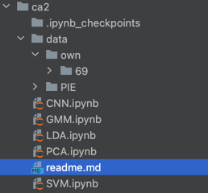

The catalogue should be constructed in this way

Environment setup:

creat -n <name> python=3.9

pip install opencv

pip install torch

pip install SVMLib or pip install libsvm-official==3.30.0

(the SVMlib may have some bug in different version and operation system, so the libsvm-official is preferred)

Run the code:
All the codes are implemented and run in Jupyter notebook.The results are already
saved and if you need to rerun the codes, just do that sequentially from up side.

Note: remember to replace the path of PIE and own photos to the folder address on your
computer. If you do not install torchvision, just annotate the relevant code, they are used to test.